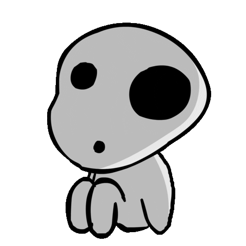

<!--
**abbeydoyle/abbeydoyle** is a ✨ _special_ ✨ repository because its `README.md` (this file) appears on your GitHub profile.

Here are some ideas to get you started:

- 🔭 I’m currently working on ...
- 🌱 I’m currently learning ...
- 👯 I’m looking to collaborate on ...
- 🤔 I’m looking for help with ...
- 💬 Ask me about ...
- 📫 How to reach me: ...
- 😄 Pronouns: ...
- ⚡ Fun fact: ...
-->


<h1 align="left">

Abigail Doyle
</h1>

<!-- ```diff
+ "yet even amidst the hatred and carnage, life is still worth living.
+ it is possible for wonderful encounters and beautiful things to exist."
+                                                   - hayao miyazaki 宮崎 駿
``` -->
<div align="right">

[](https://git.io/typing-svg)

</div>

<details open>
<summary><h2>Skills and Tools</h2></summary>
<p>
      <code></code>
      <code></code>
      <code></code>
      <code></code>
      <code></code>
      <code></code>
      <code></code>
      <code></code>
      <code></code>
      <code></code>
      <code></code>
      <code></code>
      <code></code>
      <code></code>
      <code></code>
      <code></code>
      <code></code>
      <code></code>
      <code></code>
      <code></code>
      <code></code>
      <code></code>
      <code></code>
      <code></code>
      <code></code>
      <code></code>
      <code></code>
      <code></code>
      <code></code>
      <code></code>
      <code></code>
      <code></code>
      <code></code>
      <code></code>
      <code></code>
      <code></code>
      <code></code>
</p>
</details>
<br>

<details open>
<summary><h2>Stats</h2></summary>


</details>


<br>
<details open>
<summary><h2>Donations</h2></summary>

Want to donate to my journey as a full stack developer? Don't! Instead donate to the Trevor Project [here](https://give.thetrevorproject.org/give/330001/#!/donation/checkout?c_src=pride2021&c_src2=headerDonate) to support LGBTQ+ youth. 


</details>